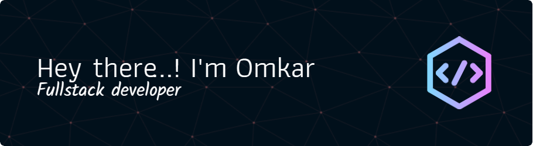

I'm Omkar, a passionate and enthusiastic technically driven person with a constant learning and development attitude (and a bit self-obsessed too, hehe).

I have various accounts, and you can find me on:
- [CodeChef](https://www.codechef.com/users/omkar_sggs)
- [GeeksforGeeks](https://auth.geeksforgeeks.org/user/omkarsathe01)
- [LeetCode](https://leetcode.com/Omkarsathe/)
- [HackerRank](https://www.hackerrank.com/profile/omkarsathe)
- [Google Cloud Skills Boost](https://www.cloudskillsboost.google/public_profiles/04439e39-6de0-4a86-90f1-36b87785a0d4)
- [AWS Certified Cloud Practitioner](https://www.credly.com/badges/7ef50f6a-4d46-4b76-9820-4f0699608755/public_url)

Have an idea and want to collaborate, or just fancy a chit-chat over a cup of coffee? Don't hesitate to drop me a mail at [omkarsathe.pers@gmail.com](mailto:omkarsathe.pers@gmail.com?subject=Hey%20Omkar,%20Let's%20Connect!&body=Please%20share%20your%20comment%20below:%0A%0A-------------------------------------%0A%0A[What's%20in%20your%20mind?]%0A%0A--------------------------------------%0A%0ASource%20Link:%20https://github.com/omkarsathe01/).

I'd love to add you to my GitHub network. Let's connect and collaborate on exciting projects! Currently, I have none in my network.

Hoping to stay in contact! Say hi on [LinkedIn](https://www.linkedin.com/in/omkarsathe01/)!

\> printf("Happy Coding");
